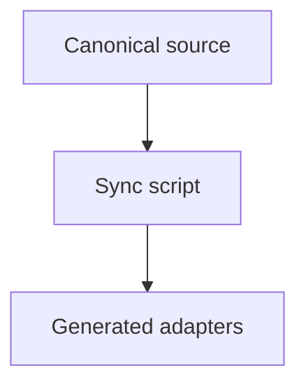

# Mermaid diagram

Category: docs.

Create a small Mermaid diagram for documentation, keeping it readable in a
plain Markdown viewer.

## Steps

1. Decide what the diagram must show and pick the diagram type:
   - `flowchart` for structure or decision flow.
   - `sequenceDiagram` for interactions over time.
   - `erDiagram` for data relationships.
2. Keep it small: prefer under ten nodes, and split a large picture into
   several focused diagrams.
3. Use short, alphanumeric node identifiers and readable labels.
4. Embed the diagram in a fenced block tagged `mermaid`.

## Example

## Rules

- Only reach for a diagram when it explains the structure better than prose.
- Keep node labels concise so the source stays legible unrendered.
