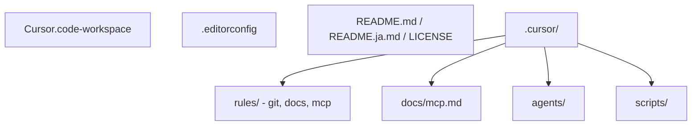
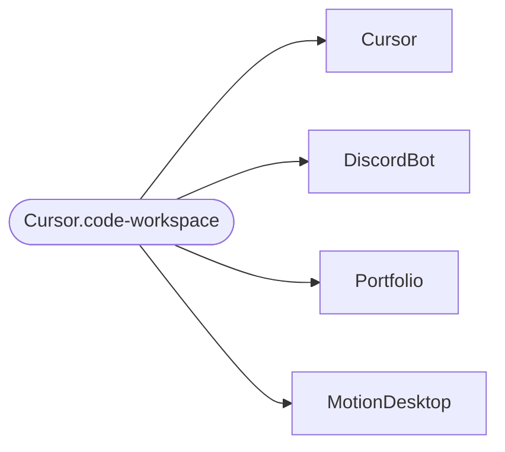

# Cursor


言語: [English](README.md) | [日本語](README.ja.md)

このリポジトリは、共有の Cursor IDE ルール、ドキュメント、ワークスペース設定を管理します。

## 概要

Cursor のルール、MCP ドキュメント、補助スクリプトを一か所に集約し、複数プロジェクトで一貫した AI エージェントのワークフローを使えるようにします。

## 構成

```text
.
├── .editorconfig              # 共有のインデント / 改行設定 (EditorConfig)
├── Cursor.code-workspace      # マルチルートワークスペース。Cursor で開くファイル
├── LICENSE
├── README.md
├── README.ja.md
└── .cursor/
    ├── README.md              # .cursor ディレクトリの索引
    ├── README.ja.md           # .cursor ディレクトリ索引の日本語版
    ├── agents/
    │   ├── README.md          # エージェント定義の配置と運用ルール
    │   └── README.ja.md       # エージェント定義ガイドの日本語版
    ├── docs/
    │   └── mcp.md             # MCP サーバー利用ガイド
    ├── rules/
    │   ├── README.md
    │   ├── README.ja.md
    │   ├── docs/
    │   │   └── readme-rules.mdc
    │   ├── git/
    │   │   └── git-rules.mdc  # Git ワークフローとコミット規約
    │   └── mcp/
    │       ├── context7-rules.mdc
    │       ├── drawio-rules.mdc
    │       ├── github-rules.mdc
    │       └── markitdown-rules.mdc
    └── scripts/
        ├── README.md          # スクリプト索引
        ├── README.ja.md       # スクリプト索引の日本語版
        ├── drawio-mcp.sh      # draw.io MCP 起動ラッパー
        └── markitdown-mcp.sh  # MarkItDown MCP (venv または PATH)
```

図として見た場合の同じ構成:



## ワークスペース

`Cursor.code-workspace` は、次のプロジェクトをマルチルートワークスペースとしてまとめます。この表は、同ファイルの `folders` 一覧とそろえて更新してください。

| フォルダー | パス | 説明 |
|------------|------|------|
| Cursor | `.` | 共有ルールと設定を管理するこのリポジトリ |
| DiscordBot | `../DiscordBot` | TypeScript 製の Discord bot |
| Portfolio | `../Portfolio` | 個人ポートフォリオサイト |
| MotionDesktop | `../MotionDesktop` | モーション計画デスクトップアプリのドキュメントとファイル |

マルチルート構成。ワークスペースファイルを開くと、これらのフォルダーが Explorer にまとめて表示されます。



## ワークスペースのヒント

- **ビルドタスク**: **Cmd+Shift+B** (macOS) または **Ctrl+Shift+B** (Windows/Linux) で、既定のビルドタスク **Git: fetch all workspaces** を実行します。
- **複数リポジトリの Git 状態**: **Terminal → Run Task… → Git: status all workspaces** で、各フォルダーの `git status -sb` を順番に出力します。
- **ウィンドウとタブ**: ワークスペース設定ではウィンドウタイトルに `${rootName}` を使い、エディターラベルを **medium** にしています。同名ファイルが複数のルートにある場合でも、どのルートを見ているか判別しやすくなります。

## ワークスペース移動とコードマップ系ツール

VS Code / Cursor の標準機能には、Visual Studio の **Code Map** のような依存関係図は含まれていません。構造把握や移動には、次の組み込み機能や拡張機能を使います。

| 目的 | 組み込み機能 |
|------|--------------|
| **開いているファイルのシンボルツリー** (クラス、関数、見出し) | **Outline** ビュー (`View → Appearance → Outline`、または Explorer の近くへ移動) |
| **パス / シンボル階層上の現在位置** | **Breadcrumbs**。エディタータブ下の各セグメントをクリックして移動 |
| **長いファイルの俯瞰スクロール表示** | **Minimap** (`View → Appearance → Minimap`。好みに応じて有効化) |
| **全ルートをまたいだシンボル名ジャンプ** | **Go to Symbol in Workspace…**。既定ショートカットは多くの場合 **Cmd+T** (macOS) / **Ctrl+T** (Windows/Linux) |
| **全フォルダー横断のテキスト検索** | **Search** (`Cmd/Ctrl+Shift+F`)。既定ではワークスペース全体が対象。必要に応じて “files to include” やフォルダー指定で絞り込み |
| **リポジトリ単位の Git** | **Source Control**。各ルートが独立したリポジトリです。一覧が多い場合は “Source Control Repositories” ビューで固定 / 非表示を調整 |
| **コードベース全体に関する質問 (Cursor)** | Chat / Composer で **`@Codebase`** を使うか、フォルダーやファイルを添付して、このワークスペースに沿った回答にします |

表と同じ考え方の概念図:

```mermaid
flowchart TB
  subgraph file["現在のファイル"]
    OL[Outline - シンボルツリー]
    BR[Breadcrumbs]
    MM[Minimap 任意]
  end
  subgraph ws["ワークスペース"]
    SYM[Go to Symbol in Workspace]
    SRC[Search]
    GIT[Source Control - リポジトリ単位]
    CB[@Codebase / Chat]
  end
```

マルチルートのヒント: **Explorer** では各ワークスペースフォルダーが別ルートとして表示されます。作業していないルートを折りたたむとノイズを減らせます。

言語固有の **import / dependency graph** が必要な場合は、Marketplace の拡張機能を利用します。例として、npm / TypeScript の依存関係ビューアーや Swift のモジュールグラフがあります。

## セットアップ

1. このリポジトリを `Cursor` としてクローンします。
2. 関連リポジトリを `Cursor` と同じ親ディレクトリに配置します。
3. Cursor で `Cursor.code-workspace` を開きます。

推奨ディレクトリ構成:

```text
Git/
├── Cursor
├── DiscordBot
├── Portfolio
└── MotionDesktop
```

## ドキュメント

- メイン索引: `.cursor/README.md` / `.cursor/README.ja.md`
- MCP セットアップガイド: `.cursor/docs/mcp.md`
- ルール索引: `.cursor/rules/README.md` / `.cursor/rules/README.ja.md`
- スクリプト索引: `.cursor/scripts/README.md` / `.cursor/scripts/README.ja.md`
- エージェント規約: `.cursor/agents/README.md` / `.cursor/agents/README.ja.md`

## ルール

| ルール | 適用タイミング | 目的 |
|--------|----------------|------|
| `git-rules.mdc` | 常時 | Conventional Commits、main のみのワークフロー、SemVer、`v1.0.0` から始まるリリースタグ |
| `readme-rules.mdc` | `**/README.md` 編集時 | README 構成、バッジ、文体、Markdown 図のガイド |
| `context7-rules.mdc` | 常時 | ライブラリドキュメント取得時に Context7 MCP を使う |
| `drawio-rules.mdc` | 必要に応じて | draw.io MCP で図を作成 / 編集するためのガイド |
| `github-rules.mdc` | 必要に応じて | GitHub MCP (issue、PR、検索、コメント) のガイド |
| `markitdown-rules.mdc` | 必要に応じて | MarkItDown MCP でドキュメントを Markdown に変換するためのガイド |

Git ワークフロー規約の詳細は、`.cursor/rules/README.md` または `.cursor/rules/README.ja.md` から確認してください。

## ライセンス

[MIT](LICENSE)
