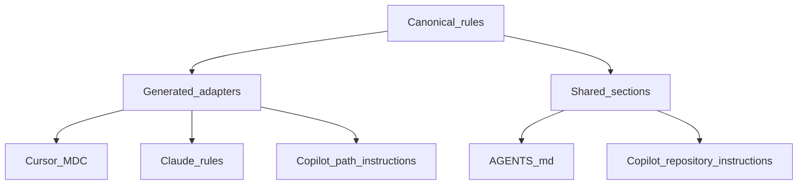

# AI Agent Config


Shared rules and local bootstrap tooling for Cursor, Claude Code, and GitHub Copilot.

## Quick start

Git is required. Every other tool in the requirements table below is optional and only disables the feature that needs it.

1. Clone the repository next to the repositories you work with.

   ```bash
   git clone https://github.com/iam74k4/ai-agent-config.git
   cd ai-agent-config
   ```

2. Run the bootstrap script for your platform.

   ```bash
   ./scripts/setup.sh
   ```

   ```powershell
   .\scripts\setup.ps1
   ```

3. Open the generated `<repository>.code-workspace` file in Cursor, then restart Cursor completely so it loads `.cursor/mcp.json`.

Setup creates a local MCP configuration, optionally installs MarkItDown, and generates the workspace file. Re-run it whenever sibling repositories change.

## Requirements

| Feature | Requirement | Behavior when unavailable |
|---|---|---|
| Core setup | Git | Setup stops because Git is required |
| Workspace and draw.io MCP | Node.js 20+ | draw.io is omitted from local MCP config |
| MarkItDown MCP | Python 3.10+ | MarkItDown is skipped with a warning |
| GitHub MCP | `GITHUB_MCP_PAT` | GitHub MCP is omitted until a token is provided |
| Higher Context7 limits | `CONTEXT7_API_KEY` | Context7 uses anonymous access |

`GITHUB_PAT` and `GITHUB_TOKEN` are accepted as compatibility aliases. Tokens are read from the environment and written only to the gitignored `.cursor/mcp.json`, which is created with owner-only permissions. Setup warns when it falls back to `GITHUB_TOKEN`, because CI systems and other tooling set that variable automatically.

## Commands

| Command | Purpose |
|---|---|
| `./scripts/setup.sh` | macOS/Linux bootstrap |
| `.\scripts\setup.ps1` | Windows PowerShell bootstrap |
| `./scripts/doctor.sh` | Non-destructive macOS/Linux diagnostic |
| `.\scripts\doctor.ps1` | Non-destructive Windows diagnostic |
| `node scripts/sync-rules.mjs` | Regenerate tool-specific rule adapters |
| `node scripts/sync-rules.mjs --check` | Fail if generated adapters have drifted |

Useful setup options are `--no-venv`, `--no-mcp`, and `--no-workspace` for Bash; PowerShell equivalents use `-NoVenv`, `-NoMcp`, and `-NoWorkspace`. `--dry-run` and `-DryRun` report what would change without writing files. Use `--force` or `-Force` only to replace an existing local MCP config.

## Rule model



- `rules/` is the single source of shared, path-aware rules.
- `.cursor/rules/generated/`, `.claude/rules/`, and `.github/instructions/` are generated in full; do not edit them.
- `AGENTS.md` and `.github/copilot-instructions.md` keep their hand-written sections and have the always-applied rules spliced between their `generated:rules` markers.
- Edit `rules/`, then run the sync command. `--check` fails when a generated file or section has drifted.
- Tool-specific MCP instructions stay in `.cursor/rules/mcp/`.

## Workspace

The generated workspace includes this repository and every Git repository beside it. It also generates matching `Git: fetch all workspaces` and `Git: status all workspaces` tasks, preventing folder/task drift.

## Documentation

- `.cursor/README.md`: Cursor-specific index
- `.cursor/docs/mcp.md`: local MCP configuration and security
- `.cursor/scripts/README.md`: Cursor MCP wrapper scripts
- `docs/release-policy.md`: release and historical-tag policy
- `rules/`: common rule sources

## License

[MIT](LICENSE)
